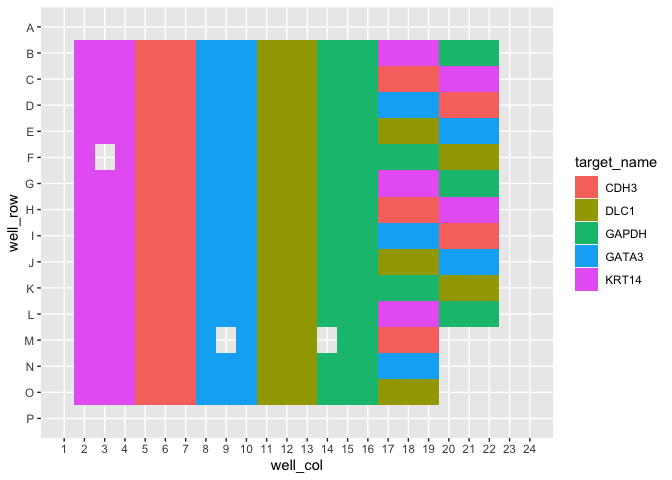

<!-- README.md is generated from README.Rmd. Please edit that file -->

# amplify 

<!-- badges: start -->
<!-- badges: end -->

**amplify** automates routine pcr-based tasks - including plate
planning, dilution making, visualizing, and analyzing - so rather than
thinking about your experiments themselves, you can think about what
your experiments *mean*.

## Installation

You can install this package from [GitHub](https://github.com/) with:

``` r
# install.packages("devtools")
devtools::install_github("KaiAragaki/amplify")
```

## Tidying qPCR data

Data from the QuantStudio software is exported in a fairly non-standard
format:

``` r
library(amplify)
library(readxl)
library(knitr)
library(dplyr)
#> 
#> Attaching package: 'dplyr'
#> The following objects are masked from 'package:stats':
#> 
#>     filter, lag
#> The following objects are masked from 'package:base':
#> 
#>     intersect, setdiff, setequal, union

untidy_file_path <- system.file("extdata", "untidy-pcr-example.xls", package = "amplify")

untidy_file_path |> 
  read_excel() |> 
  head() |> 
  kable()
#> New names:
#> * `` -> ...3
#> * `` -> ...4
#> * `` -> ...5
#> * `` -> ...6
#> * `` -> ...7
#> * ...
```

| Block Type                                     | 384-Well Block | …3  | …4  | …5  | …6  | …7  | …8  | …9  | …10 | …11 | …12 | …13 |
|:-----------------------------------------------|:---------------|:----|:----|:----|:----|:----|:----|:----|:----|:----|:----|:----|
| Calibration Background is expired              | Yes            | NA  | NA  | NA  | NA  | NA  | NA  | NA  | NA  | NA  | NA  | NA  |
| Calibration Background performed on            | 01-13-2020     | NA  | NA  | NA  | NA  | NA  | NA  | NA  | NA  | NA  | NA  | NA  |
| Calibration Normalization FAM-ROX is expired   | Yes            | NA  | NA  | NA  | NA  | NA  | NA  | NA  | NA  | NA  | NA  | NA  |
| Calibration Normalization FAM-ROX performed on | 01-13-2020     | NA  | NA  | NA  | NA  | NA  | NA  | NA  | NA  | NA  | NA  | NA  |
| Calibration Normalization VIC-ROX is expired   | Yes            | NA  | NA  | NA  | NA  | NA  | NA  | NA  | NA  | NA  | NA  | NA  |
| Calibration Normalization VIC-ROX performed on | 01-13-2020     | NA  | NA  | NA  | NA  | NA  | NA  | NA  | NA  | NA  | NA  | NA  |

amplify provides `pcr_tidy` to automatically tidy these files:

``` r
tidy_pcr <- untidy_file_path |> 
  pcr_tidy()
#> New names:
#> * `` -> ...3
#> * `` -> ...4
#> * `` -> ...5
#> * `` -> ...6
#> * `` -> ...7
#> * ...
#> Warning in mask$eval_all_mutate(quo): NAs introduced by coercion

tidy_pcr |> 
  head() |> 
  knitr::kable()
```

| well | well_position | omit  | sample_name | target_name | task    | reporter | quencher | quantity | quantity_mean | quantity_sd |  rq |    rq_min |   rq_max |       ct |  ct_mean |     ct_sd | delta_ct | delta_ct_mean      | delta_ct_se          | delta_delta_ct | automatic_ct_threshold | ct_threshold | automatic_baseline | baseline_start | baseline_end | comments | well_row | well_col | analysis_type | control | conf_int | ref_samp | plate_type     | exp_type |
|:-----|:--------------|:------|:------------|:------------|:--------|:---------|:---------|---------:|--------------:|------------:|----:|----------:|---------:|---------:|---------:|----------:|:---------|:-------------------|:---------------------|:---------------|:-----------------------|-------------:|:-------------------|---------------:|-------------:|:---------|---------:|---------:|:--------------|:--------|:---------|:---------|:---------------|:---------|
| 26   | B2            | FALSE | RD1         | KRT14       | UNKNOWN | FAM      | NFQ-MGB  |       NA |            NA |          NA |   1 | 0.9316003 | 1.073422 | 29.70135 | 29.74859 | 0.0474225 | NA       | 7.8036408424377441 | 0.036815796047449112 | 0              | TRUE                   |    0.2075911 | TRUE               |              3 |           24 | NA       |        2 |        2 | Singleplex    | GAPDH   | 95.0     | RD1      | 384-Well Block | comp     |
| 27   | B3            | FALSE | RD1         | KRT14       | UNKNOWN | FAM      | NFQ-MGB  |       NA |            NA |          NA |   1 | 0.9316003 | 1.073422 | 29.79619 | 29.74859 | 0.0474225 | NA       | 7.8036408424377441 | 0.036815796047449112 | 0              | TRUE                   |    0.2075911 | TRUE               |              3 |           23 | NA       |        2 |        3 | Singleplex    | GAPDH   | 95.0     | RD1      | 384-Well Block | comp     |
| 28   | B4            | FALSE | RD1         | KRT14       | UNKNOWN | FAM      | NFQ-MGB  |       NA |            NA |          NA |   1 | 0.9316003 | 1.073422 | 29.74823 | 29.74859 | 0.0474225 | NA       | 7.8036408424377441 | 0.036815796047449112 | 0              | TRUE                   |    0.2075911 | TRUE               |              3 |           24 | NA       |        2 |        4 | Singleplex    | GAPDH   | 95.0     | RD1      | 384-Well Block | comp     |
| 29   | B5            | FALSE | RD1         | CDH3        | UNKNOWN | FAM      | NFQ-MGB  |       NA |            NA |          NA |   1 | 0.9305190 | 1.074669 | 28.92050 | 28.89161 | 0.0488189 | NA       | 6.946662425994873  | 0.037419259548187256 | 0              | TRUE                   |    0.5056610 | TRUE               |              3 |           23 | NA       |        2 |        5 | Singleplex    | GAPDH   | 95.0     | RD1      | 384-Well Block | comp     |
| 30   | B6            | FALSE | RD1         | CDH3        | UNKNOWN | FAM      | NFQ-MGB  |       NA |            NA |          NA |   1 | 0.9305190 | 1.074669 | 28.91909 | 28.89161 | 0.0488189 | NA       | 6.946662425994873  | 0.037419259548187256 | 0              | TRUE                   |    0.5056610 | TRUE               |              3 |           22 | NA       |        2 |        6 | Singleplex    | GAPDH   | 95.0     | RD1      | 384-Well Block | comp     |
| 31   | B7            | FALSE | RD1         | CDH3        | UNKNOWN | FAM      | NFQ-MGB  |       NA |            NA |          NA |   1 | 0.9305190 | 1.074669 | 28.83525 | 28.89161 | 0.0488189 | NA       | 6.946662425994873  | 0.037419259548187256 | 0              | TRUE                   |    0.5056610 | TRUE               |              3 |           22 | NA       |        2 |        7 | Singleplex    | GAPDH   | 95.0     | RD1      | 384-Well Block | comp     |

This can be done for both *Δ**Δ*Ct qPCR or standard curve qPCR.

## Plotting qPCR results

Tidied results can be plotted using `pcr_plot`

``` r
tidy_pcr |> 
  pcr_plot()
#> Warning: Removed 18 rows containing missing values (position_stack).
```


Additionally, overviews of plate features can be done using `pcr_plate`

``` r
tidy_pcr |> 
  pcr_plate_view(target_name)
#> Warning: `guides(<scale> = FALSE)` is deprecated. Please use `guides(<scale> =
#> "none")` instead.
```



More details can be found in the “Analyzing ddCt qPCR with amplify”
vignette.

## Library Preparation Quantification

### Library Preparation Quantification Calculation

RNA library preparation results output from Quantstudio can be tidied
using `pcr_tidy`:

``` r
untidy_lib_path <- system.file("extdata", "untidy-standard-curve.xlsx", package = "amplify")
tidy_lib <- pcr_tidy(untidy_lib_path) 
#> New names:
#> * `` -> ...3
#> * `` -> ...4
#> * `` -> ...5
#> * `` -> ...6
#> * `` -> ...7
#> * ...
#> Warning in mask$eval_all_mutate(quo): NAs introduced by coercion
tidy_lib |> head() |> kable()
```

| well | well_position | omit  | sample_name | target_name | task     | reporter | quencher |       ct |  ct_mean |     ct_sd |  quantity | quantity_mean | quantity_sd | automatic_ct_threshold | ct_threshold | automatic_baseline | baseline_start | baseline_end | comments | y_intercept |     r2 |   slope | efficiency | well_row | well_col | plate_type                 | exp_type |
|:-----|:--------------|:------|:------------|:------------|:---------|:---------|:---------|---------:|---------:|----------:|----------:|--------------:|------------:|:-----------------------|-------------:|:-------------------|---------------:|-------------:|:---------|------------:|-------:|--------:|-----------:|---------:|---------:|:---------------------------|:---------|
| 1    | A1            | FALSE | NA          | Target 1    | STANDARD | FAM      | NFQ-MGB  | 15.35837 | 15.44140 | 0.0726362 | 6.8000002 |            NA |          NA | TRUE                   |    0.2177651 | TRUE               |              1 |           40 | NA       |      18.223 | 0.9992 | -3.4827 |   93.70175 |        1 |        1 | Fast 96-Well Block (0.1mL) | stan     |
| 2    | A2            | FALSE | NA          | Target 1    | STANDARD | FAM      | NFQ-MGB  | 15.47261 | 15.44140 | 0.0726362 | 6.8000002 |            NA |          NA | TRUE                   |    0.2177651 | TRUE               |              1 |           40 | NA       |      18.223 | 0.9992 | -3.4827 |   93.70175 |        1 |        2 | Fast 96-Well Block (0.1mL) | stan     |
| 3    | A3            | FALSE | NA          | Target 1    | STANDARD | FAM      | NFQ-MGB  | 15.49321 | 15.44140 | 0.0726362 | 6.8000002 |            NA |          NA | TRUE                   |    0.2177651 | TRUE               |              1 |           40 | NA       |      18.223 | 0.9992 | -3.4827 |   93.70175 |        1 |        3 | Fast 96-Well Block (0.1mL) | stan     |
| 5    | A5            | FALSE | Sample 1    | Target 1    | UNKNOWN  | FAM      | NFQ-MGB  | 18.96735 | 18.99822 | 0.0436533 | 0.6113234 |     0.5990987 |   0.0172884 | TRUE                   |    0.2177651 | TRUE               |              1 |           40 | NA       |      18.223 | 0.9992 | -3.4827 |   93.70175 |        1 |        5 | Fast 96-Well Block (0.1mL) | stan     |
| 6    | A6            | FALSE | Sample 1    | Target 1    | UNKNOWN  | FAM      | NFQ-MGB  | 19.02909 | 18.99822 | 0.0436533 | 0.5868739 |     0.5990987 |   0.0172884 | TRUE                   |    0.2177651 | TRUE               |              1 |           40 | NA       |      18.223 | 0.9992 | -3.4827 |   93.70175 |        1 |        6 | Fast 96-Well Block (0.1mL) | stan     |
| 8    | A8            | FALSE | Sample 9    | Target 1    | UNKNOWN  | FAM      | NFQ-MGB  | 17.92027 | 17.92443 | 0.0058898 | 1.2215880 |     1.2182336 |   0.0047438 | TRUE                   |    0.2177651 | TRUE               |              1 |           40 | NA       |      18.223 | 0.9992 | -3.4827 |   93.70175 |        1 |        8 | Fast 96-Well Block (0.1mL) | stan     |

Calculating the concentration of library can be performed using
`pcr_lib_calc`:

``` r
calc_lib <- tidy_lib |> 
  pcr_lib_calc()

calc_lib |> select(task, sample_name, concentration) |> head() |> kable()
```

| task     | sample_name | concentration |
|:---------|:------------|--------------:|
| STANDARD | NA          |            NA |
| STANDARD | NA          |            NA |
| STANDARD | NA          |            NA |
| UNKNOWN  | Sample 6    |      2039.379 |
| UNKNOWN  | Sample 6    |      2039.379 |
| UNKNOWN  | Sample 6    |      2039.379 |

### Library preparation quantification quality control

We can generate useful plots to determine the quality of the
quantification run by first using `pcr_lib_qc`:

``` r
qc <- calc_lib |> 
  pcr_lib_qc()
qc
#> $standards
#> # A tibble: 13 × 8
#> # Groups:   task [1]
#>    task     quantity quant_actual   dil slope efficiency    r2    ct
#>    <chr>       <dbl>        <dbl> <dbl> <dbl>      <dbl> <dbl> <dbl>
#>  1 STANDARD 6.80         6.8       0    -3.48       93.7 0.999  15.4
#>  2 STANDARD 6.80         6.8       0    -3.48       93.7 0.999  15.5
#>  3 STANDARD 6.80         6.8       0    -3.48       93.7 0.999  15.5
#>  4 STANDARD 0.680        0.734     9.27 -3.48       93.7 0.999  18.7
#>  5 STANDARD 0.680        0.734     9.27 -3.48       93.7 0.999  18.6
#>  6 STANDARD 0.0680       0.0603   12.2  -3.48       93.7 0.999  22.3
#>  7 STANDARD 0.0680       0.0603   12.2  -3.48       93.7 0.999  22.2
#>  8 STANDARD 0.0680       0.0603   12.2  -3.48       93.7 0.999  22.3
#>  9 STANDARD 0.00680      0.00568  10.6  -3.48       93.7 0.999  25.7
#> 10 STANDARD 0.00680      0.00568  10.6  -3.48       93.7 0.999  25.6
#> 11 STANDARD 0.00680      0.00568  10.6  -3.48       93.7 0.999  25.7
#> 12 STANDARD 0.000680     0.000417 13.6  -3.48       93.7 0.999  29.4
#> 13 STANDARD 0.000680     0.000417 13.6  -3.48       93.7 0.999  29.4
#> 
#> $samples
#> # A tibble: 42 × 10
#> # Groups:   task [1]
#>    task    sample_name quantity_mean concentration quantity quant_actual slope
#>    <chr>   <chr>               <dbl>         <dbl>    <dbl>        <dbl> <dbl>
#>  1 UNKNOWN Sample 6             2.04         2039.     2.06         2.06 -3.48
#>  2 UNKNOWN Sample 6             2.04         2039.     2.12         2.12 -3.48
#>  3 UNKNOWN Sample 6             2.04         2039.     1.94         1.94 -3.48
#>  4 UNKNOWN Sample 12            1.89         1893.     1.93         1.93 -3.48
#>  5 UNKNOWN Sample 12            1.89         1893.     1.88         1.88 -3.48
#>  6 UNKNOWN Sample 12            1.89         1893.     1.87         1.87 -3.48
#>  7 UNKNOWN Sample 4             1.69         1694.     1.62         1.62 -3.48
#>  8 UNKNOWN Sample 4             1.69         1694.     1.84         1.84 -3.48
#>  9 UNKNOWN Sample 4             1.69         1694.     1.62         1.62 -3.48
#> 10 UNKNOWN Sample 16            1.49         1493.     1.46         1.46 -3.48
#> # … with 32 more rows, and 3 more variables: efficiency <dbl>, r2 <dbl>,
#> #   ct <dbl>
#> 
#> $sample_summary
#> # A tibble: 16 × 3
#>    sample_name quantity_mean concentration_mean
#>    <chr>               <dbl>              <dbl>
#>  1 Sample 1            0.599               599.
#>  2 Sample 10           1.07               1066.
#>  3 Sample 11           1.03               1031.
#>  4 Sample 12           1.89               1893.
#>  5 Sample 13           0.583               583.
#>  6 Sample 14           1.22               1216.
#>  7 Sample 15           0.713               713.
#>  8 Sample 16           1.49               1493.
#>  9 Sample 2            1.05               1052.
#> 10 Sample 3            1.37               1367.
#> 11 Sample 4            1.69               1694.
#> 12 Sample 5            0.903               903.
#> 13 Sample 6            2.04               2039.
#> 14 Sample 7            1.13               1132.
#> 15 Sample 8            1.09               1088.
#> 16 Sample 9            1.22               1218.
#> 
#> $standard_summary
#> # A tibble: 10 × 4
#>    quantity   dil name             value
#>       <dbl> <dbl> <chr>            <dbl>
#>  1 0.000680 13.6  quantity_mean 0.000680
#>  2 0.000680 13.6  quant_actual  0.000417
#>  3 0.00680  10.6  quantity_mean 0.00680 
#>  4 0.00680  10.6  quant_actual  0.00568 
#>  5 0.0680   12.2  quantity_mean 0.0680  
#>  6 0.0680   12.2  quant_actual  0.0603  
#>  7 0.680     9.27 quantity_mean 0.680   
#>  8 0.680     9.27 quant_actual  0.734   
#>  9 6.80      0    quantity_mean 6.80    
#> 10 6.80      0    quant_actual  6.8     
#> 
#> $outliers
#> # A tibble: 58 × 17
#> # Groups:   sample_name [22]
#>    task     sample_name quantity_mean   dil slope efficiency    r2    ct quantity
#>    <chr>    <chr>               <dbl> <dbl> <dbl>      <dbl> <dbl> <dbl>    <dbl>
#>  1 STANDARD 1                   NA        0 -3.48       93.7 0.999  15.4     6.80
#>  2 STANDARD 1                   NA        0 -3.48       93.7 0.999  15.5     6.80
#>  3 STANDARD 1                   NA        0 -3.48       93.7 0.999  15.5     6.80
#>  4 UNKNOWN  Sample 6             2.04    NA -3.48       93.7 0.999  17.1     2.06
#>  5 UNKNOWN  Sample 6             2.04    NA -3.48       93.7 0.999  17.1     2.12
#>  6 UNKNOWN  Sample 6             2.04    NA -3.48       93.7 0.999  17.2     1.94
#>  7 UNKNOWN  Sample 12            1.89    NA -3.48       93.7 0.999  17.2     1.93
#>  8 UNKNOWN  Sample 12            1.89    NA -3.48       93.7 0.999  17.3     1.88
#>  9 UNKNOWN  Sample 12            1.89    NA -3.48       93.7 0.999  17.3     1.87
#> 10 UNKNOWN  Sample 4             1.69    NA -3.48       93.7 0.999  17.5     1.62
#> # … with 48 more rows, and 8 more variables: quant_actual <dbl>,
#> #   concentration <dbl>, no_po_mean <dbl>, no_po_sd <dbl>, keep <lgl>,
#> #   adj_mean <dbl>, adj_sd <dbl>, z <dbl>
```

These data, by themselves, are not particularly useful. However, they
can be used for more elucidative downstream analyses like
`pcr_qc_report`

``` r
# Generates a file - not run
# qc |> pcr_lib_qc_report()
```
