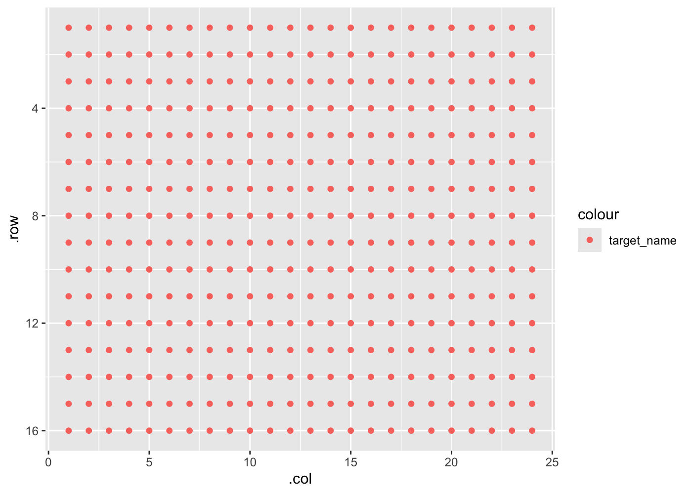
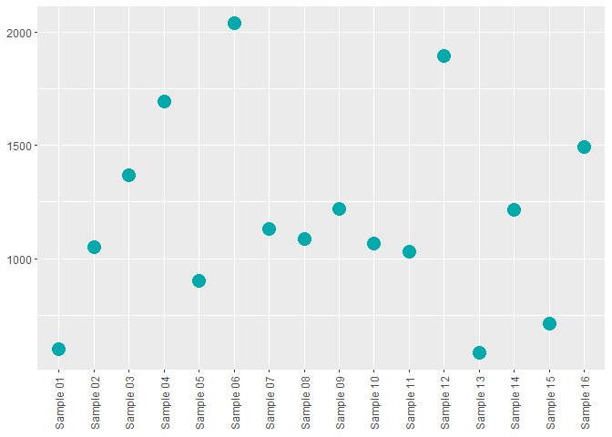

<!-- README.md is generated from README.Rmd. Please edit that file -->

# amplify 

<!-- badges: start -->
<!-- badges: end -->

**amplify** automates routine pcr-based tasks - including plate
planning, dilution making, visualizing, and analyzing - so rather than
thinking about your experiments themselves, you can think about what
your experiments *mean*.

## Installation

You can install this package from [GitHub](https://github.com/) with:

``` r
# install.packages("devtools")
devtools::install_github("KaiAragaki/amplify")
```

``` r
library(amplify)
library(readxl)
library(knitr)
library(dplyr)
```

## Tidying qPCR data

Data exported from QuantStudio is fairly non-standard:

``` r
untidy_file_path <- system.file("extdata", "untidy-pcr-example.xls", package = "amplify")

untidy_file_path |> 
  read_excel() |>
  select(1:10) |> 
  head()
#> New names:
#> * `` -> ...3
#> * `` -> ...4
#> * `` -> ...5
#> * `` -> ...6
#> * `` -> ...7
#> * ...
#> # A tibble: 6 x 10
#>   `Block Type`  `384-Well Block` ...3  ...4  ...5  ...6  ...7  ...8  ...9  ...10
#>   <chr>         <chr>            <chr> <chr> <chr> <chr> <chr> <chr> <chr> <chr>
#> 1 Calibration ~ Yes              <NA>  <NA>  <NA>  <NA>  <NA>  <NA>  <NA>  <NA> 
#> 2 Calibration ~ 01-13-2020       <NA>  <NA>  <NA>  <NA>  <NA>  <NA>  <NA>  <NA> 
#> 3 Calibration ~ Yes              <NA>  <NA>  <NA>  <NA>  <NA>  <NA>  <NA>  <NA> 
#> 4 Calibration ~ 01-13-2020       <NA>  <NA>  <NA>  <NA>  <NA>  <NA>  <NA>  <NA> 
#> 5 Calibration ~ Yes              <NA>  <NA>  <NA>  <NA>  <NA>  <NA>  <NA>  <NA> 
#> 6 Calibration ~ 01-13-2020       <NA>  <NA>  <NA>  <NA>  <NA>  <NA>  <NA>  <NA>
```

amplify provides `pcr_tidy` to automatically tidy these files:

``` r
tidy_pcr <- untidy_file_path |> 
  pcr_tidy()

tidy_pcr |>
  select(1:10) |> 
  head()
#> # A tibble: 6 x 10
#>   well  well_position omit  sample_name target_name task    reporter quencher
#>   <chr> <chr>         <lgl> <chr>       <chr>       <chr>   <chr>    <chr>   
#> 1 26    B2            FALSE RD1         KRT14       UNKNOWN FAM      NFQ-MGB 
#> 2 27    B3            FALSE RD1         KRT14       UNKNOWN FAM      NFQ-MGB 
#> 3 28    B4            FALSE RD1         KRT14       UNKNOWN FAM      NFQ-MGB 
#> 4 29    B5            FALSE RD1         CDH3        UNKNOWN FAM      NFQ-MGB 
#> 5 30    B6            FALSE RD1         CDH3        UNKNOWN FAM      NFQ-MGB 
#> 6 31    B7            FALSE RD1         CDH3        UNKNOWN FAM      NFQ-MGB 
#> # ... with 2 more variables: quantity <dbl>, quantity_mean <dbl>
```

`pcr_tidy` works with both ddCt or standard curve result files.

## Plotting qPCR results

Tidied results can be plotted using `pcr_plot`

``` r
tidy_pcr |> 
  pcr_plot()
#> Warning: Removed 18 rows containing missing values (position_stack).
```


Additionally, overviews of plate features can be done using `pcr_plate`

``` r
tidy_pcr |> 
  pcr_plate_view(target_name)
```



More details can be found in the **Analyzing ddCt qPCR with amplify**
vignette.

## Library Preparation Quantification

### Library Preparation Quantification Calculation

RNA library preparation results output from Quantstudio can be tidied
using `pcr_tidy`:

``` r
untidy_lib_path <- system.file("extdata", "untidy-standard-curve.xlsx", package = "amplify")
tidy_lib <- pcr_tidy(untidy_lib_path, pad_zero = TRUE) 
tidy_lib |>
  select(1:10) |> 
  head()
#> # A tibble: 6 x 10
#>   well  well_position omit  sample_name target_name task     reporter quencher
#>   <chr> <chr>         <lgl> <chr>       <chr>       <chr>    <chr>    <chr>   
#> 1 1     A1            FALSE <NA>        Target 1    STANDARD FAM      NFQ-MGB 
#> 2 2     A2            FALSE <NA>        Target 1    STANDARD FAM      NFQ-MGB 
#> 3 3     A3            FALSE <NA>        Target 1    STANDARD FAM      NFQ-MGB 
#> 4 5     A5            FALSE Sample 01   Target 1    UNKNOWN  FAM      NFQ-MGB 
#> 5 6     A6            FALSE Sample 01   Target 1    UNKNOWN  FAM      NFQ-MGB 
#> 6 8     A8            FALSE Sample 09   Target 1    UNKNOWN  FAM      NFQ-MGB 
#> # ... with 2 more variables: ct <dbl>, ct_mean <dbl>
```

Calculating the concentration of library (before dilution) can be
performed using `pcr_lib_calc`:

``` r
calc_lib <- pcr_lib_calc(tidy_lib) 

calc_lib |> 
  select(task, sample_name, concentration) |> 
  head()
#> # A tibble: 6 x 3
#> # Groups:   task [2]
#>   task     sample_name concentration
#>   <chr>    <chr>               <dbl>
#> 1 STANDARD <NA>                  NA 
#> 2 STANDARD <NA>                  NA 
#> 3 STANDARD <NA>                  NA 
#> 4 UNKNOWN  Sample 06           2039.
#> 5 UNKNOWN  Sample 06           2039.
#> 6 UNKNOWN  Sample 06           2039.
```

### Library preparation quantification quality control

We can generate useful plots to determine the quality of the
quantification run by first using `pcr_lib_qc`:

``` r
qc <- calc_lib |> 
  pcr_lib_qc()
qc
#> $standards
#> # A tibble: 13 x 8
#> # Groups:   task [1]
#>    task     quantity quant_actual   dil slope efficiency    r2    ct
#>    <chr>       <dbl>        <dbl> <dbl> <dbl>      <dbl> <dbl> <dbl>
#>  1 STANDARD 6.80         6.8       0    -3.48       93.7 0.999  15.4
#>  2 STANDARD 6.80         6.8       0    -3.48       93.7 0.999  15.5
#>  3 STANDARD 6.80         6.8       0    -3.48       93.7 0.999  15.5
#>  4 STANDARD 0.680        0.734     9.27 -3.48       93.7 0.999  18.7
#>  5 STANDARD 0.680        0.734     9.27 -3.48       93.7 0.999  18.6
#>  6 STANDARD 0.0680       0.0603   12.2  -3.48       93.7 0.999  22.3
#>  7 STANDARD 0.0680       0.0603   12.2  -3.48       93.7 0.999  22.2
#>  8 STANDARD 0.0680       0.0603   12.2  -3.48       93.7 0.999  22.3
#>  9 STANDARD 0.00680      0.00568  10.6  -3.48       93.7 0.999  25.7
#> 10 STANDARD 0.00680      0.00568  10.6  -3.48       93.7 0.999  25.6
#> 11 STANDARD 0.00680      0.00568  10.6  -3.48       93.7 0.999  25.7
#> 12 STANDARD 0.000680     0.000417 13.6  -3.48       93.7 0.999  29.4
#> 13 STANDARD 0.000680     0.000417 13.6  -3.48       93.7 0.999  29.4
#> 
#> $samples
#> # A tibble: 42 x 10
#> # Groups:   task [1]
#>    task    sample_name quantity_mean concentration quantity quant_actual slope
#>    <chr>   <chr>               <dbl>         <dbl>    <dbl>        <dbl> <dbl>
#>  1 UNKNOWN Sample 06            2.04         2039.     2.06         2.06 -3.48
#>  2 UNKNOWN Sample 06            2.04         2039.     2.12         2.12 -3.48
#>  3 UNKNOWN Sample 06            2.04         2039.     1.94         1.94 -3.48
#>  4 UNKNOWN Sample 12            1.89         1893.     1.93         1.93 -3.48
#>  5 UNKNOWN Sample 12            1.89         1893.     1.88         1.88 -3.48
#>  6 UNKNOWN Sample 12            1.89         1893.     1.87         1.87 -3.48
#>  7 UNKNOWN Sample 04            1.69         1694.     1.62         1.62 -3.48
#>  8 UNKNOWN Sample 04            1.69         1694.     1.84         1.84 -3.48
#>  9 UNKNOWN Sample 04            1.69         1694.     1.62         1.62 -3.48
#> 10 UNKNOWN Sample 16            1.49         1493.     1.46         1.46 -3.48
#> # ... with 32 more rows, and 3 more variables: efficiency <dbl>, r2 <dbl>,
#> #   ct <dbl>
#> 
#> $sample_summary
#> # A tibble: 16 x 3
#>    sample_name quantity_mean concentration_mean
#>    <chr>               <dbl>              <dbl>
#>  1 Sample 01           0.599               599.
#>  2 Sample 02           1.05               1052.
#>  3 Sample 03           1.37               1367.
#>  4 Sample 04           1.69               1694.
#>  5 Sample 05           0.903               903.
#>  6 Sample 06           2.04               2039.
#>  7 Sample 07           1.13               1132.
#>  8 Sample 08           1.09               1088.
#>  9 Sample 09           1.22               1218.
#> 10 Sample 10           1.07               1066.
#> 11 Sample 11           1.03               1031.
#> 12 Sample 12           1.89               1893.
#> 13 Sample 13           0.583               583.
#> 14 Sample 14           1.22               1216.
#> 15 Sample 15           0.713               713.
#> 16 Sample 16           1.49               1493.
#> 
#> $standard_summary
#> # A tibble: 10 x 4
#>    quantity   dil name             value
#>       <dbl> <dbl> <chr>            <dbl>
#>  1 0.000680 13.6  quantity_mean 0.000680
#>  2 0.000680 13.6  quant_actual  0.000417
#>  3 0.00680  10.6  quantity_mean 0.00680 
#>  4 0.00680  10.6  quant_actual  0.00568 
#>  5 0.0680   12.2  quantity_mean 0.0680  
#>  6 0.0680   12.2  quant_actual  0.0603  
#>  7 0.680     9.27 quantity_mean 0.680   
#>  8 0.680     9.27 quant_actual  0.734   
#>  9 6.80      0    quantity_mean 6.80    
#> 10 6.80      0    quant_actual  6.8     
#> 
#> $outliers
#> # A tibble: 58 x 17
#> # Groups:   sample_name [22]
#>    task     sample_name quantity_mean   dil slope efficiency    r2    ct quantity
#>    <chr>    <chr>               <dbl> <dbl> <dbl>      <dbl> <dbl> <dbl>    <dbl>
#>  1 STANDARD 1                   NA        0 -3.48       93.7 0.999  15.4     6.80
#>  2 STANDARD 1                   NA        0 -3.48       93.7 0.999  15.5     6.80
#>  3 STANDARD 1                   NA        0 -3.48       93.7 0.999  15.5     6.80
#>  4 UNKNOWN  Sample 06            2.04    NA -3.48       93.7 0.999  17.1     2.06
#>  5 UNKNOWN  Sample 06            2.04    NA -3.48       93.7 0.999  17.1     2.12
#>  6 UNKNOWN  Sample 06            2.04    NA -3.48       93.7 0.999  17.2     1.94
#>  7 UNKNOWN  Sample 12            1.89    NA -3.48       93.7 0.999  17.2     1.93
#>  8 UNKNOWN  Sample 12            1.89    NA -3.48       93.7 0.999  17.3     1.88
#>  9 UNKNOWN  Sample 12            1.89    NA -3.48       93.7 0.999  17.3     1.87
#> 10 UNKNOWN  Sample 04            1.69    NA -3.48       93.7 0.999  17.5     1.62
#> # ... with 48 more rows, and 8 more variables: quant_actual <dbl>,
#> #   concentration <dbl>, no_po_mean <dbl>, no_po_sd <dbl>, keep <lgl>,
#> #   adj_mean <dbl>, adj_sd <dbl>, z <dbl>
```

These data, by themselves, are not particularly useful. However, a suite
of QC plotting functions can be used upon these data to give insight,
such as:

``` r
qc |> pcr_lib_qc_plot_conc()
```



``` r
# Generates a file - not run
# qc |> pcr_lib_qc_report()
```
