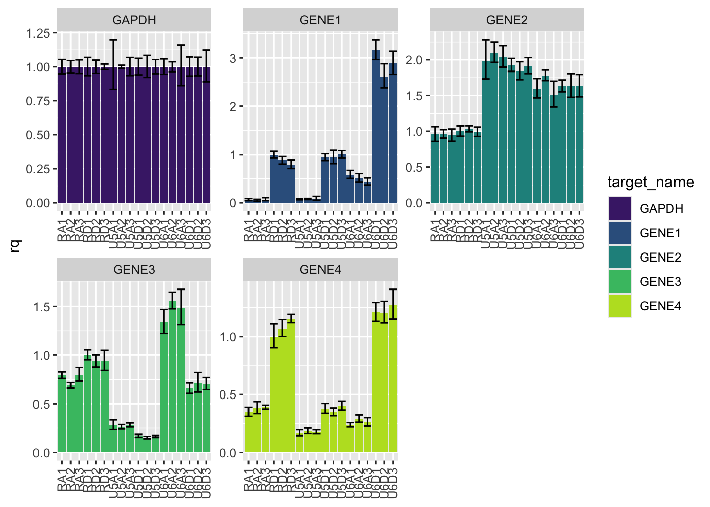
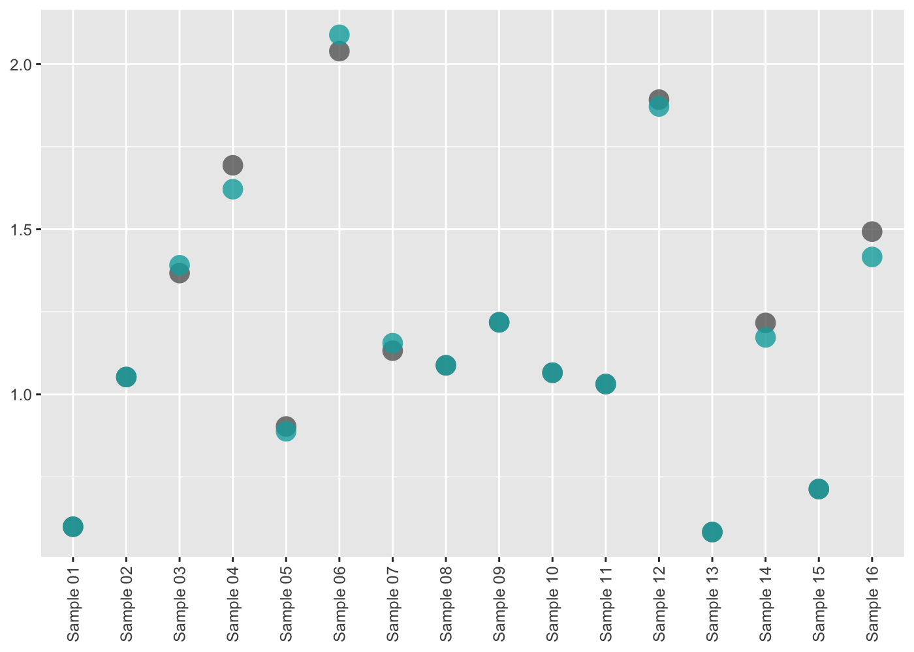

<!-- README.md is generated from README.Rmd. Please edit that file -->

# amplify 

<!-- badges: start -->
<!-- badges: end -->

**amplify** automates routine pcr-based tasks - including plate
planning, dilution making, visualizing, and analyzing - so rather than
thinking about your experiments themselves, you can think about what
your experiments *mean*.

## Installation

You can install this package from [GitHub](https://github.com/) with:

``` r
# install.packages("devtools")
devtools::install_github("KaiAragaki/amplify")
```

``` r
library(amplify)
library(readxl)
library(knitr)
library(dplyr)
```

## Tidying qPCR data

Data exported from QuantStudio is fairly non-standard:

``` r
untidy_file_path <- system.file("extdata", "untidy-pcr-example.xls", package = "amplify")

untidy_file_path |> 
  read_excel() |>
  select(1:10) |> 
  head()
#> New names:
#> * `` -> ...3
#> * `` -> ...4
#> * `` -> ...5
#> * `` -> ...6
#> * `` -> ...7
#> * ...
#> # A tibble: 6 × 10
#>   `Block Type`  `384-Well Block` ...3  ...4  ...5  ...6  ...7  ...8  ...9  ...10
#>   <chr>         <chr>            <chr> <chr> <chr> <chr> <chr> <chr> <chr> <chr>
#> 1 Calibration … Yes              <NA>  <NA>  <NA>  <NA>  <NA>  <NA>  <NA>  <NA> 
#> 2 Calibration … 01-13-2020       <NA>  <NA>  <NA>  <NA>  <NA>  <NA>  <NA>  <NA> 
#> 3 Calibration … Yes              <NA>  <NA>  <NA>  <NA>  <NA>  <NA>  <NA>  <NA> 
#> 4 Calibration … 01-13-2020       <NA>  <NA>  <NA>  <NA>  <NA>  <NA>  <NA>  <NA> 
#> 5 Calibration … Yes              <NA>  <NA>  <NA>  <NA>  <NA>  <NA>  <NA>  <NA> 
#> 6 Calibration … 01-13-2020       <NA>  <NA>  <NA>  <NA>  <NA>  <NA>  <NA>  <NA>
```

amplify provides `pcr_tidy` to automatically tidy these files:

``` r
tidy_pcr <- untidy_file_path |> 
  pcr_tidy()

tidy_pcr |>
  select(1:10) |> 
  head()
#> # A tibble: 6 × 10
#>   well  well_position omit  sample_name target_name task    reporter quencher
#>   <chr> <chr>         <lgl> <chr>       <chr>       <chr>   <chr>    <chr>   
#> 1 26    B2            FALSE RD1         GENE1       UNKNOWN FAM      NFQ-MGB 
#> 2 27    B3            FALSE RD1         GENE1       UNKNOWN FAM      NFQ-MGB 
#> 3 28    B4            FALSE RD1         GENE1       UNKNOWN FAM      NFQ-MGB 
#> 4 29    B5            FALSE RD1         GENE2       UNKNOWN FAM      NFQ-MGB 
#> 5 30    B6            FALSE RD1         GENE2       UNKNOWN FAM      NFQ-MGB 
#> 6 31    B7            FALSE RD1         GENE2       UNKNOWN FAM      NFQ-MGB 
#> # … with 2 more variables: quantity <dbl>, quantity_mean <dbl>
```

`pcr_tidy` works with both ddCt or standard curve result files.

## Plotting qPCR results

Tidied results can be plotted using `pcr_plot`

``` r
tidy_pcr |> 
  pcr_plot()
#> Warning: Removed 18 rows containing missing values (position_stack).
```



Additionally, overviews of plate features can be done using `pcr_plate`

``` r
tidy_pcr |> 
  pcr_plate_view("target_name")
```


More details can be found in the **Analyzing ddCt qPCR with amplify**
vignette.

## Library Preparation Quantification

### Library Preparation Quantification Calculation

RNA library preparation results output from Quantstudio can be tidied
using `pcr_tidy`:

``` r
untidy_lib_path <- system.file("extdata", "untidy-standard-curve.xlsx", package = "amplify")
tidy_lib <- pcr_tidy(untidy_lib_path, pad_zero = TRUE) 
tidy_lib |>
  select(1:10) |> 
  head()
#> # A tibble: 6 × 10
#>   well  well_position omit  sample_name target_name task     reporter quencher
#>   <chr> <chr>         <lgl> <chr>       <chr>       <chr>    <chr>    <chr>   
#> 1 1     A1            FALSE Standard 01 Target 1    STANDARD FAM      NFQ-MGB 
#> 2 2     A2            FALSE Standard 01 Target 1    STANDARD FAM      NFQ-MGB 
#> 3 3     A3            FALSE Standard 01 Target 1    STANDARD FAM      NFQ-MGB 
#> 4 5     A5            FALSE Sample 01   Target 1    UNKNOWN  FAM      NFQ-MGB 
#> 5 6     A6            FALSE Sample 01   Target 1    UNKNOWN  FAM      NFQ-MGB 
#> 6 8     A8            FALSE Sample 09   Target 1    UNKNOWN  FAM      NFQ-MGB 
#> # … with 2 more variables: ct <dbl>, ct_mean <dbl>
```

Calculating the concentration of library (before dilution) can be
performed using `pcr_lib_calc`:

``` r
calc_lib <- pcr_lib_calc(tidy_lib) 

calc_lib |> 
  select(task, sample_name, concentration) |> 
  head()
#> # A tibble: 6 × 3
#> # Groups:   task [2]
#>   task     sample_name concentration
#>   <chr>    <chr>               <dbl>
#> 1 STANDARD Standard 01           NA 
#> 2 STANDARD Standard 01           NA 
#> 3 STANDARD Standard 01           NA 
#> 4 UNKNOWN  Sample 06           2039.
#> 5 UNKNOWN  Sample 06           2039.
#> 6 UNKNOWN  Sample 06           2039.
```

### Library preparation quantification quality control

We can generate useful plots to determine the quality of the
quantification run by first using `pcr_lib_qc`:

``` r
qc <- calc_lib |> 
  pcr_lib_qc()
qc
#> $standards
#> # A tibble: 13 × 19
#> # Groups:   sample_name [5]
#>    sample_name task     quantity_mean concentration quantity quant_actual   dil
#>    <chr>       <chr>            <dbl>         <dbl>    <dbl>        <dbl> <dbl>
#>  1 Standard 01 STANDARD            NA            NA 6.80         6.80      0   
#>  2 Standard 01 STANDARD            NA            NA 6.80         6.80      0   
#>  3 Standard 01 STANDARD            NA            NA 6.80         6.80      0   
#>  4 Standard 02 STANDARD            NA            NA 0.680        0.734     9.27
#>  5 Standard 02 STANDARD            NA            NA 0.680        0.734     9.27
#>  6 Standard 03 STANDARD            NA            NA 0.0680       0.0603   12.2 
#>  7 Standard 03 STANDARD            NA            NA 0.0680       0.0603   12.2 
#>  8 Standard 03 STANDARD            NA            NA 0.0680       0.0603   12.2 
#>  9 Standard 04 STANDARD            NA            NA 0.00680      0.00568  10.6 
#> 10 Standard 04 STANDARD            NA            NA 0.00680      0.00568  10.6 
#> 11 Standard 04 STANDARD            NA            NA 0.00680      0.00568  10.6 
#> 12 Standard 05 STANDARD            NA            NA 0.000680     0.000417 13.6 
#> 13 Standard 05 STANDARD            NA            NA 0.000680     0.000417 13.6 
#> # … with 12 more variables: slope <dbl>, efficiency <dbl>, r2 <dbl>, ct <dbl>,
#> #   no_po_mean <dbl>, no_po_sd <dbl>, keep <lgl>, keep_temp <lgl>,
#> #   mean_adj <dbl>, sd_adj <dbl>, quant_adj <dbl>, z <dbl>
#> 
#> $samples
#> # A tibble: 42 × 19
#> # Groups:   sample_name [16]
#>    sample_name task    quantity_mean concentration quantity quant_actual   dil
#>    <chr>       <chr>           <dbl>         <dbl>    <dbl>        <dbl> <dbl>
#>  1 Sample 06   UNKNOWN          2.04         2039.     2.06         2.06    NA
#>  2 Sample 06   UNKNOWN          2.04         2039.     2.12         2.12    NA
#>  3 Sample 06   UNKNOWN          2.04         2039.     1.94         1.94    NA
#>  4 Sample 12   UNKNOWN          1.89         1893.     1.93         1.93    NA
#>  5 Sample 12   UNKNOWN          1.89         1893.     1.88         1.88    NA
#>  6 Sample 12   UNKNOWN          1.89         1893.     1.87         1.87    NA
#>  7 Sample 04   UNKNOWN          1.69         1694.     1.62         1.62    NA
#>  8 Sample 04   UNKNOWN          1.69         1694.     1.84         1.84    NA
#>  9 Sample 04   UNKNOWN          1.69         1694.     1.62         1.62    NA
#> 10 Sample 16   UNKNOWN          1.49         1493.     1.46         1.46    NA
#> # … with 32 more rows, and 12 more variables: slope <dbl>, efficiency <dbl>,
#> #   r2 <dbl>, ct <dbl>, no_po_mean <dbl>, no_po_sd <dbl>, keep <lgl>,
#> #   keep_temp <lgl>, mean_adj <dbl>, sd_adj <dbl>, quant_adj <dbl>, z <dbl>
#> 
#> $sample_summary
#> # A tibble: 16 × 3
#>    sample_name quantity_mean quant_adj
#>    <chr>               <dbl>     <dbl>
#>  1 Sample 01           0.599     0.599
#>  2 Sample 02           1.05      1.05 
#>  3 Sample 03           1.37      1.39 
#>  4 Sample 04           1.69      1.62 
#>  5 Sample 05           0.903     0.888
#>  6 Sample 06           2.04      2.09 
#>  7 Sample 07           1.13      1.15 
#>  8 Sample 08           1.09      1.09 
#>  9 Sample 09           1.22      1.22 
#> 10 Sample 10           1.07      1.07 
#> 11 Sample 11           1.03      1.03 
#> 12 Sample 12           1.89      1.87 
#> 13 Sample 13           0.583     0.583
#> 14 Sample 14           1.22      1.17 
#> 15 Sample 15           0.713     0.713
#> 16 Sample 16           1.49      1.42 
#> 
#> $standard_summary
#> # A tibble: 5 × 4
#>   sample_name   dil quantity_mean quant_actual
#>   <chr>       <dbl>         <dbl>        <dbl>
#> 1 Standard 01  0         6.80         6.80    
#> 2 Standard 02  9.27      0.680        0.734   
#> 3 Standard 03 12.2       0.0680       0.0603  
#> 4 Standard 04 10.6       0.00680      0.00568 
#> 5 Standard 05 13.6       0.000680     0.000417
#> 
#> $outliers
#> # A tibble: 58 × 19
#> # Groups:   sample_name [22]
#>    sample_name task     quantity_mean concentration quantity quant_actual   dil
#>    <chr>       <chr>            <dbl>         <dbl>    <dbl>        <dbl> <dbl>
#>  1 Standard 01 STANDARD         NA              NA      6.80         6.80     0
#>  2 Standard 01 STANDARD         NA              NA      6.80         6.80     0
#>  3 Standard 01 STANDARD         NA              NA      6.80         6.80     0
#>  4 Sample 06   UNKNOWN           2.04         2039.     2.06         2.06    NA
#>  5 Sample 06   UNKNOWN           2.04         2039.     2.12         2.12    NA
#>  6 Sample 06   UNKNOWN           2.04         2039.     1.94         1.94    NA
#>  7 Sample 12   UNKNOWN           1.89         1893.     1.93         1.93    NA
#>  8 Sample 12   UNKNOWN           1.89         1893.     1.88         1.88    NA
#>  9 Sample 12   UNKNOWN           1.89         1893.     1.87         1.87    NA
#> 10 Sample 04   UNKNOWN           1.69         1694.     1.62         1.62    NA
#> # … with 48 more rows, and 12 more variables: slope <dbl>, efficiency <dbl>,
#> #   r2 <dbl>, ct <dbl>, no_po_mean <dbl>, no_po_sd <dbl>, keep <lgl>,
#> #   keep_temp <lgl>, mean_adj <dbl>, sd_adj <dbl>, quant_adj <dbl>, z <dbl>
```

These data, by themselves, are not particularly useful. However, a suite
of QC plotting functions can be used upon these data to give insight,
such as:

``` r
qc |> pcr_lib_qc_plot_conc()
```



All QC plotting functions can be run and generate a report using
`pcr_lib_qc_report`.

``` r
qc |> pcr_lib_qc_report("path/to/my/report.html")
```

More information about the plots available, as well as their
interpretations, can be found in **Performing Library Quantification
QC**
